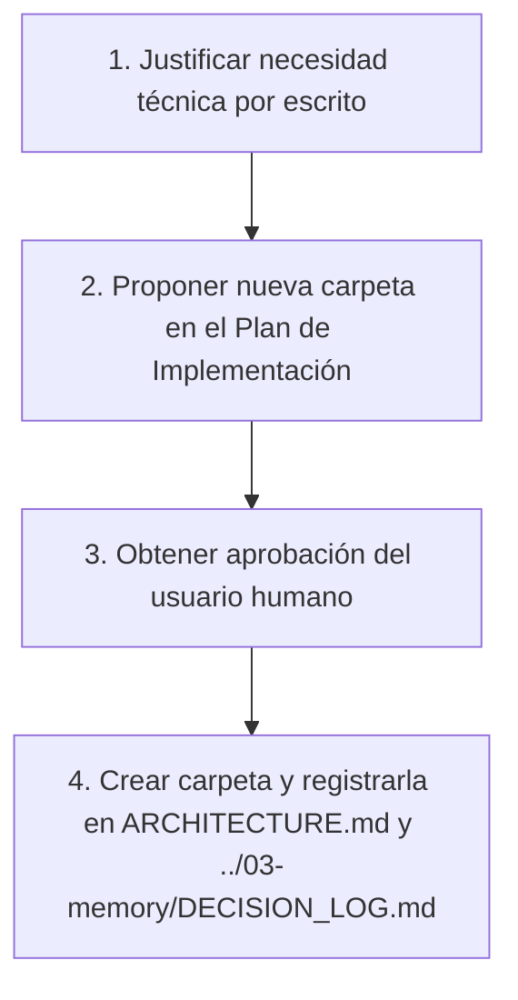

# 11 - LEYES DE CARPETA E INTEGRIDAD ESTRUCTURAL

Este documento define la constitución física y estructural de los archivos y directorios en el proyecto **Tony Burgers**. Estas leyes rigen sobre cualquier agente (humano o de IA) para evitar el caos estructural, la acumulación de basura y la dispersión de código.

---

## 1. Leyes Constitucionales de Estructura (Obligatorio)

### LAW_006 - FOLDER INTEGRITY LAW
La arquitectura de carpetas es sagrada.
Prohibido:
- Crear carpetas arbitrarias.
- Crear carpetas duplicadas.
- Crear variantes.
Ejemplos prohibidos:
- `components-v2`
- `components-new`
- `widgets-new`
- `helpers2`
- `shared-v2`
- `common-new`
Antes de crear una carpeta:
1. Justificar necesidad.
2. Actualizar ARCHITECTURE.md.
3. Actualizar PROJECT_MEMORY.md.

### LAW_007 - NO JUNK FILES
Prohibido:
- `test.tsx`
- `test-final.tsx`
- `new-component.tsx`
- `copy.tsx`
- `backup.tsx`
- `draft.tsx`
- `component-fixed.tsx`
Todo archivo debe tener propósito real.

### LAW_008 - NO ORPHAN FILES
Todo archivo debe pertenecer a:
- un dominio
- una funcionalidad
- una responsabilidad
No se permiten archivos sin propietario lógico.

### LAW_009 - SINGLE RESPONSIBILITY LOCATION
Una responsabilidad.
Una ubicación.
Un lugar obvio.
Si existen dos ubicaciones posibles para un archivo:
La arquitectura está mal definida.

---

## 2. Ejemplos de Aplicación Práctica

### A) Folder Integrity (LAW_006)
*   **Permitido:** Si necesitas crear componentes para una nueva funcionalidad del menú como el carrito flotante, agrégalos dentro del dominio de negocio existente en `src/components/features/cart/CartDrawer.tsx`.
*   **Prohibido:** Crear una carpeta `src/components/cart-v2/` o `src/components/cart-new/` para probar un diseño nuevo sin antes haber cambiado el sistema en un ADR y actualizado `../01-foundation/ARCHITECTURE.md`.

### B) Evitar Archivos Basura (LAW_007)
*   **Permitido:** Crear `src/components/features/menu/IngredientSelector.tsx` con su implementación completa y limpia.
*   **Prohibido:** Dejar en el repositorio `src/components/features/menu/IngredientSelector-backup.tsx` o `src/components/features/menu/IngredientSelector-fixed.tsx`. Si se requiere control de versiones, se debe utilizar Git. Los archivos con sufijos `-test`, `-copy`, `-fixed` serán rechazados en el build.

### C) Archivos Huérfanos y Responsabilidad Única (LAW_008 / LAW_009)
*   **Permitido:** Colocar una función que formatea precios (`formatPrice`) en `src/utils/formatPrice.ts` porque es su lugar obvio.
*   **Prohibido:** Duplicar la misma lógica de formato en `src/components/features/menu/MenuItem.tsx` bajo una función interna del componente, o crear un archivo flotante `src/helpers.ts` sin dominio definido.

---

## 3. Proceso para Modificación de Estructura (Extensibilidad)

Si una tarea futura requiere de manera ineludible la creación de una nueva carpeta en el árbol de directorios de `src/`, el agente debe seguir obligatoriamente este procedimiento antes de crearla:

Cualquier carpeta creada que no esté registrada en la última versión aprobada de `../01-foundation/ARCHITECTURE.md` será considerada una violación directa de **LAW_006** y será eliminada en el siguiente ciclo de integración de código.
