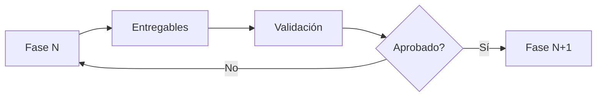
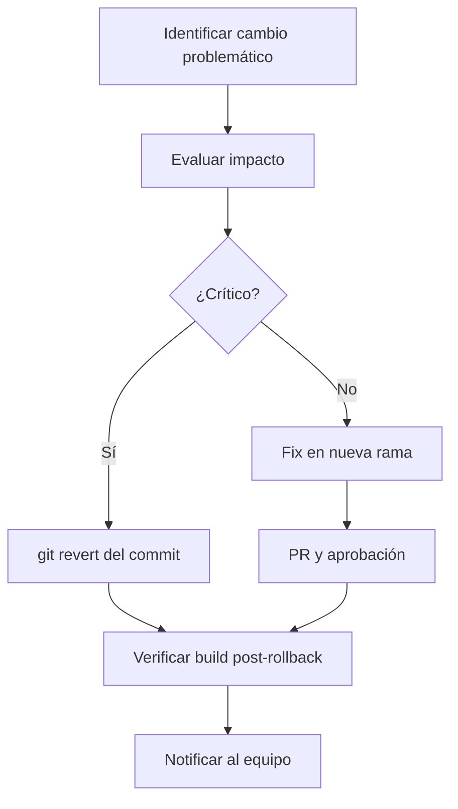

# 22 - ESTRATEGIA DE ENTREGA (DELIVERY STRATEGY)

Este documento define la estrategia de ejecución y entrega del proyecto **Tony Burgers**. Establece cómo se entrega valor incrementalmente, cómo se secuencian las dependencias y cómo se gestionan los riesgos durante el desarrollo.

---

## 1. MODELO DE ENTREGA INCREMENTAL

El proyecto sigue un modelo de entrega **incremental basado en fases**. Cada fase produce un entregable funcional que puede ser verificado de forma independiente.

### Principios del Modelo

| Principio | Descripción |
| :--- | :--- |
| **Fase Completa** | Cada fase debe completarse al 100% antes de avanzar a la siguiente. |
| **Entregable Verificable** | Cada fase produce al menos un entregable verificable. |
| **Sin Deuda Técnica Acumulada** | No se permite saltar trabajo de una fase para completarlo después. |
| **Aprobación por Fase** | Cada fase requiere aprobación explícita para cerrarse. |

### Flujo de Entrega



---

## 2. ORDEN DE IMPLEMENTACIÓN DE FUNCIONALIDADES

El orden de implementación sigue estrictamente las dependencias entre fases:

### Secuencia Maestra

```
FASE 0: Discovery
  └── Visión del producto, alcance, límites

FASE 1: Project Setup
  └── Entorno de desarrollo, dependencias base

FASE 2: Architecture
  └── Estructura de carpetas, convenciones, gobernanza

FASE 3: Design System 🔵 [ACTIVA]
  └── Tokens de diseño, componentes UI, temas

FASE 4: Core Components [SIGUIENTE]
  ├── Componentes de Menú → MenuGrid, MenuItemCard, IngredientSelector
  ├── Componentes de Carrito → CartDrawer, CartSummary, CheckoutForm
  ├── Componentes de Reservas → BookingCalendar, TableSelector
  └── Componentes de Admin → OrderManager, InventorySwitch

FASE 5: Page Assembly
  ├── HomePage
  ├── MenuPage
  ├── BookingPage
  └── AdminPage

FASE 6: Responsive Design
  └── Breakpoints, layouts adaptables, touch optimization

FASE 7: SEO
  └── Meta tags, Open Graph, sitemap

FASE 8: Performance
  └── Lazy loading, code splitting, optimización de assets

FASE 9: Testing
  └── Tests unitarios, integración, E2E

FASE 10: Deployment
  └── CI/CD, hosting, dominio
```

### Orden Interno por Fase

Dentro de cada fase, las funcionalidades se implementan en este orden:

1. **Dependencias base** — Lo que otros elementos necesitan para funcionar.
2. **Elementos críticos** — Lo que tiene mayor impacto en el flujo de usuario.
3. **Elementos secundarios** — Mejoras y detalles después de lo crítico.

**Ejemplo (Phase 4):**
1. `types/` — Definiciones de tipos primero.
2. `services/` — Servicios mock y persistencia.
3. `context/` — Estado global.
4. `hooks/` — Hooks personalizados.
5. `features/` — Componentes de feature.

---

## 3. SECUENCIACIÓN DE DEPENDENCIAS

### Dependencias Técnicas

| Elemento | Depende de | Fase |
| :--- | :--- | :--- |
| Componentes UI | Nada (puramente visuales) | P3 |
| Hooks personalizados | Tipos, servicios | P4 |
| Contextos globales | Hooks, servicios | P4 |
| Componentes de feature | Componentes UI, hooks, contextos | P4 |
| Páginas | Componentes de feature, layout | P5 |
| Diseño responsivo | Páginas completas | P6 |
| SEO | Páginas estables | P7 |
| Performance | Páginas y assets | P8 |
| Tests | Código estable | P9 |
| Deploy | Código verificado | P10 |

### Regla de Secuenciación

> **Ningún elemento puede implementarse si su dependencia no está completa y verificada.**

---

## 4. ESTRATEGIA DE REDUCCIÓN DE RIESGOS

### Identificación de Riesgos por Fase

| Fase | Riesgo | Mitigación |
| :--- | :--- | :--- |
| P3 Design System | Sobrediseño o componentes demasiado genéricos | Crear solo lo necesario para las features conocidas |
| P4 Core Components | Acoplamiento excesivo entre componentes | Uso estricto de props, no compartir estado global innecesariamente |
| P5 Page Assembly | Páginas muy pesadas | Composición limpia, delegar lógica a hooks |
| P6 Responsive | Rotura de layouts existentes | Pruebas por breakpoint, cambios incrementales |
| P7 SEO | Meta tags incorrectos afectando indexing | Validación con herramientas de testing SEO |
| P8 Performance | Optimización prematura | Medir antes de optimizar |
| P9 Testing | Tests frágiles o no deterministas | Tests aislados, mocks controlados |
| P10 Deploy | Configuración incorrecta | Staging environment antes de producción |

### Estrategias Generales

1. **Prototipado rápido:** Validar decisiones complejas con prototipos antes de la implementación completa.
2. **Revisión por pares:** Todo código nuevo debe ser revisado antes de integrarse.
3. **Validación continua:** Build y typecheck se ejecutan después de cada cambio significativo.
4. **Revertibilidad:** Cada cambio debe ser reversible. Commits atómicos y descriptivos.

---

## 5. PUNTOS DE VALIDACIÓN (VALIDATION CHECKPOINTS)

Cada fase tiene puntos de validación obligatorios:

### Checkpoint 1 — Inicio de Fase
- [ ] Entry criteria de la fase verificados.
- [ ] Fase anterior completada y aprobada.
- [ ] Plan de implementación creado.

### Checkpoint 2 — Mitad de Fase
- [ ] Progreso ≥ 50% de los deliverables.
- [ ] Build exitoso.
- [ ] Sin desviaciones del alcance.

### Checkpoint 3 — Fin de Fase
- [ ] Todos los deliverables existentes.
- [ ] Build, lint, typecheck pasan.
- [ ] Phase Completion Report generado.

---

## 6. PUNTOS DE REVISIÓN (REVIEW CHECKPOINTS)

| Punto | Cuándo | Quién Revisa | Qué Se Revisa |
| :--- | :--- | :--- | :--- |
| R1 | Diseño de solución | Arquitecto | Decisión técnica, impacto arquitectónico |
| R2 | Implementación parcial (50%) | Desarrollador senior | Calidad de código, adherence a estándares |
| R3 | Pre-entrega de fase | QA / Usuario | Funcionalidad, regresión, UX |
| R4 | Post-entrega | Stakeholders | Cumplimiento de objetivos de fase |

---

## 7. PUNTOS DE APROBACIÓN (APPROVAL CHECKPOINTS)

| Punto | Requisito | Aprueba |
| :--- | :--- | :--- |
| A1 — Plan de Fase | Plan detallado aprobado | Usuario humano |
| A2 — Validación de Fase | Build + lint + typecheck pasan | Sistema / Agente |
| A3 — Cierre de Fase | Phase Completion Report | Usuario humano |
| A4 — Avance de Fase | Fase anterior cerrada + entry criteria | Usuario humano |

---

## 8. ESTRATEGIA DE ROLLBACK

### Cuándo Hacer Rollback

Se ejecuta rollback cuando:
1. Un cambio rompe el build de producción.
2. Una funcionalidad implementada no cumple los criterios de aceptación.
3. Se descubre un error crítico después del despliegue.
4. Una decisión técnica resultó incorrecta y afecta la estabilidad.

### Procedimiento de Rollback



### Reglas de Rollback

| Regla | Descripción |
| :--- | :--- |
| **Commits Atómicos** | Cada cambio debe ser un commit atómico y descriptivo para facilitar rollbacks. |
| **Sin Commits Masivos** | No mezclar cambios no relacionados en un solo commit. |
| **Tags de Versión** | Cada hito de fase debe tener un tag de Git. |
| **Revertir, No Eliminar** | Usar `git revert` en lugar de eliminar commits del historial. |

---

## 9. MATRIZ DE DEPENDENCIA CRUZADA

| Fase | Depende de | Dependientes |
| :--- | :--- | :--- |
| P0 Discovery | — | P1, P2 |
| P1 Project Setup | P0 | P2 |
| P2 Architecture | P0, P1 | P3, P4, P5 |
| P3 Design System | P2 | P4 |
| P4 Core Components | P2, P3 | P5 |
| P5 Page Assembly | P4 | P6, P7 |
| P6 Responsive Design | P5 | — |
| P7 SEO | P5 | P8 |
| P8 Performance | P7 | P9 |
| P9 Testing | P8 | P10 |
| P10 Deployment | P9 | — |

---

## 10. REFERENCIAS

| Documento | Propósito |
| :--- | :--- |
| `./ROADMAP.md` | Mapa de ruta con fases |
| `./PHASE_DEFINITIONS.md` | Definiciones detalladas por fase |
| `../00-governance/REPOSITORY_GOVERNANCE.md` | Leyes de gobernanza |
| `../02-development/TASK_WORKFLOW.md` | Flujo de trabajo de tareas |
