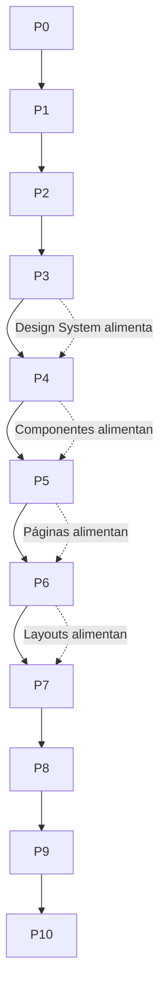

# 20 - ROADMAP: PROYECCIÓN OFICIAL DEL PROYECTO

Este documento define la progresión oficial del proyecto **Tony Burgers**. Constituye la fuente autoritaria de la planificación del desarrollo. Ningún trabajo puede realizarse fuera del marco de fases aquí definido.

**Ley Aplicable:** LAW_028 — ROADMAP IS AUTHORITATIVE

---

## 1. VISUALIZACIÓN DEL ROADMAP

**Legend:**
- 🟢 **Completed** — Phase finished and verified
- 🔵 **Active** — Current development phase
- ⏸️ **Deferred** — Postponed (not a dependency for active phase)
- ⚪ **Future** — Not yet accessible

---

## 2. ESTADO ACTUAL DEL PROYECTO

| Propiedad | Valor |
| :--- | :--- |
| **Current Phase** | PHASE 5 — Page Assembly |
| **Current Phase Marker** | `[ACTIVE]` |
| **Phase Started** | 2026-06-13 |
| **Progress** | 45% (5 of 11 phases completed) |

---

## 3. FASES DEL PROYECTO

### PHASE 0 — Discovery `[COMPLETED]`
| Propiedad | Detalle |
| :--- | :--- |
| **Estado** | 🟢 Completado |
| **Fecha de Finalización** | 2026-06-13 |
| **Deliverable Clave** | `01_VISION.md` — Visión estratégica del producto |
| **Exit Criteria** | Documento de visión aprobado |

---

### PHASE 1 — Project Setup `[COMPLETED]`
| Propiedad | Detalle |
| :--- | :--- |
| **Estado** | 🟢 Completado |
| **Fecha de Finalización** | 2026-06-13 |
| **Deliverables Clave** | `package.json`, `tsconfig.json`, `vite.config.ts`, `index.html` |
| **Exit Criteria** | Build inicial exitoso, servidor de desarrollo funcional |

---

### PHASE 2 — Architecture `[COMPLETED]`
| Propiedad | Detalle |
| :--- | :--- |
| **Estado** | 🟢 Completado |
| **Fecha de Finalización** | 2026-06-13 |
| **Deliverables Clave** | `02_ARCHITECTURE.md`, `11_FOLDER_LAWS.md`, `15_NAMING_CONVENTIONS.md` |
| **Exit Criteria** | Arquitectura documentada, estructura de carpetas establecida |

---

### PHASE 3 — Design System 🟢 `[COMPLETED]`
| Propiedad | Detalle |
| :--- | :--- |
| **Estado** | 🟢 Completado |
| **Fecha de Finalización** | 2026-06-13 |
| **Deliverables Clave** | Tokens de diseño (colores, tipografía, espaciado), componentes UI atómicos (40+), tema oscuro |
| **Entry Criteria** | Architecture documentada y aprobada |
| **Exit Criteria** | Todos los componentes UI primitivos creados y documentados |

---

### PHASE 4 — Core Components `[DEFERRED]`
| Propiedad | Detalle |
| :--- | :--- |
| **Estado** | ⏸️ Diferido (no es dependencia del Landing Page) |
| **Deliverables Clave** | Componentes de negocio: menú, carrito, reservas, panel admin |
| **Entry Criteria** | Design System completado y aprobado |
| **Exit Criteria** | Todos los componentes de feature implementados y funcionales |

---

### PHASE 5 — Page Assembly 🔵 `[ACTIVE]`
| Propiedad | Detalle |
| :--- | :--- |
| **Estado** | 🔵 Activo |
| **Deliverables Clave** | Páginas completas: Landing Page (Home) con todas las secciones |
| **Entry Criteria** | Design System completado y aprobado; Section Assembly Governance (ADR-005) |
| **Exit Criteria** | Landing page con todas las secciones ensambladas, navegable, build exitoso |

---

### PHASE 6 — Responsive Design `[FUTURE]`
| Propiedad | Detalle |
| :--- | :--- |
| **Estado** | ⚪ Futuro |
| **Deliverables Clave** | Diseño responsivo completo, breakpoints validados |
| **Entry Criteria** | Page Assembly completada |
| **Exit Criteria** | Todas las páginas verificadas en mobile, tablet y desktop |

---

### PHASE 7 — SEO `[FUTURE]`
| Propiedad | Detalle |
| :--- | :--- |
| **Estado** | ⚪ Futuro |
| **Deliverables Clave** | Meta tags, Open Graph, sitemap, robots.txt |
| **Entry Criteria** | Responsive Design completado |
| **Exit Criteria** | Auditoría SEO básica superada |

---

### PHASE 8 — Performance `[FUTURE]`
| Propiedad | Detalle |
| :--- | :--- |
| **Estado** | ⚪ Futuro |
| **Deliverables Clave** | Lazy loading, optimización de imágenes, bundle splitting |
| **Entry Criteria** | SEO completado |
| **Exit Criteria** | Lighthouse score ≥ 90 en todas las categorías |

---

### PHASE 9 — Testing `[FUTURE]`
| Propiedad | Detalle |
| :--- | :--- |
| **Estado** | ⚪ Futuro |
| **Deliverables Clave** | Pruebas unitarias, pruebas de integración, pruebas E2E |
| **Entry Criteria** | Performance completado |
| **Exit Criteria** | Cobertura de tests ≥ 80% en componentes críticos |

---

### PHASE 10 — Deployment `[FUTURE]`
| Propiedad | Detalle |
| :--- | :--- |
| **Estado** | ⚪ Futuro |
| **Deliverables Clave** | Configuración de CI/CD, despliegue a producción |
| **Entry Criteria** | Testing completado |
| **Exit Criteria** | Aplicación desplegada y accesible públicamente |

---

## 4. DEPENDENCIAS ENTRE FASES

**Reglas de Dependencia:**
1. Una fase no puede comenzar hasta que su fase predecesora directa esté completada.
2. El Design System (P3) debe estar completo antes de crear componentes de negocio (P4).
3. Los Core Components (P4) pueden diferirse si el Landing Page solo utiliza componentes UI presentacionales (ver ADR-005).
4. Las páginas ensambladas (P5) son requisito para el diseño responsivo (P6).
5. Las optimizaciones de SEO (P7) y Performance (P8) ocurren después de la estabilización visual.

---

## 5. FASES BLOQUEADAS

Actualmente no hay fases bloqueadas. Una fase se considera bloqueada cuando:
- Su fase predecesora ha fallado la validación de salida.
- Una dependencia externa no está disponible.
- Una decisión arquitectónica pendiente impide el progreso.

---

## 6. RESTRICCIONES DE FASES FUTURAS

| Restricción | Descripción |
| :--- | :--- |
| **No Phase Bleeding** | No se permite trabajo de fases futuras durante la fase activa |
| **Phase Gate Enforcement** | Cada fase nueva requiere aprobación de salida de la fase anterior |
| **Entry Criteria Verification** | No se puede iniciar una fase sin verificar los criterios de entrada |

---

## 7. CRITERIOS DE SALIDA DE FASE (PHASE EXIT CRITERIA)

Para que una fase se considere completada, deben cumplirse:

1. **Todos los deliverables** de la fase existen y están documentados.
2. **Validación técnica:** Build, lint y typecheck pasan sin errores.
3. **Documentación actualizada:** Los cambios están registrados en `../03-memory/PROJECT_MEMORY.md`.
4. **Reporte de fase:** Se ha generado un Phase Completion Report (LAW_030).
5. **Aprobación:** El responsable humano ha aprobado el cierre de la fase.

---

## 8. CRITERIOS DE ENTRADA DE FASE (PHASE ENTRY CRITERIA)

Para que una fase nueva pueda comenzar, deben cumplirse:

1. **Fase anterior completada** con todos los exit criteria satisfechos.
2. **Phase Completion Report** de la fase anterior generado y archivado.
3. **Recursos disponibles:** No existen bloqueos técnicos o de decisión pendientes.
4. **Autorización:** El avance a la siguiente fase ha sido aprobado.

---

## 9. HISTORIAL DE AVANCE DE FASE

| Fecha | Fase | Evento | Responsable |
| :--- | :--- | :--- | :--- |
| 2026-06-13 | PHASE 0 | Completada | Sistema |
| 2026-06-13 | PHASE 1 | Completada | Sistema |
| 2026-06-13 | PHASE 2 | Completada | Sistema |
| 2026-06-13 | PHASE 3 | Activada | Sistema |
| 2026-06-13 | PHASE 3 | Completada | Sistema |
| 2026-06-13 | PHASE 4 | Diferida (ver ADR-005) | Sistema |
| 2026-06-13 | PHASE 5 | Activada | Sistema |

---

## 10. REFERENCIAS

| Documento | Propósito |
| :--- | :--- |
| `./PHASE_DEFINITIONS.md` | Definición detallada de cada fase |
| `./DELIVERY_STRATEGY.md` | Estrategia de entrega y ejecución |
| `../00-governance/REPOSITORY_GOVERNANCE.md` | Leyes de gobernanza aplicables |
| `../02-development/TASK_WORKFLOW.md` | Flujo de trabajo de tareas |
