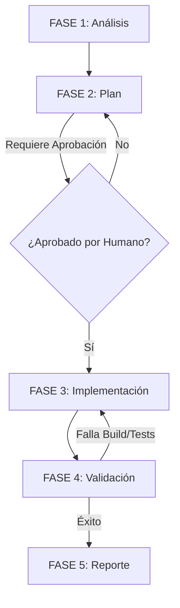

# 05 - FLUJO DE TRABAJO DE TAREAS

Este documento establece el flujo de trabajo secuencial y obligatorio para la resolución de cualquier tarea en el proyecto **Tony Burgers**. Ningún agente (humano o de IA) puede saltarse ninguna de las fases detalladas a continuación.

---

## Representación Visual del Flujo de Trabajo



---

## Leyes de Gobernanza del Flujo de Trabajo (Obligatorio)

### LAW_017 - BOOT SEQUENCE REQUIRED
Todo agente debe ejecutar:
1. Leer VISION
2. Leer ARCHITECTURE
3. Leer AI_RULES
4. Leer PROJECT_MEMORY
5. Analizar tarea
6. Crear plan
7. Ejecutar

### LAW_018 - CHANGE BOUNDARY ENFORCEMENT
Todo trabajo debe declarar:
- archivos permitidos
- archivos prohibidos
- alcance
- criterio de éxito

### LAW_023 - PLAN BEFORE CODE
Before implementation the agent must provide:
* Analysis
* Plan
* Affected files
* Risks
* Validation strategy
Implementation cannot begin before planning is completed.

### LAW_024 - DOCUMENT ACKNOWLEDGEMENT
Before implementation the agent must explicitly confirm:
Documents read
Relevant restrictions
Architectural constraints
Required output format:
```text
Boot Sequence Completed

Documents Read:
✓ VISION
✓ ARCHITECTURE
✓ AI_RULES
✓ PROJECT_MEMORY

Relevant Constraints:
…
```
Only after acknowledgement may implementation begin.

---

## FASE 1: Análisis y Diagnóstico (Boot Sequence)

El objetivo de esta fase es comprender a fondo el problema o requerimiento sin alterar el código del proyecto.

1.  **Arranque Obligatorio:** Se debe comenzar obligatoriamente siguiendo paso a paso la ley **LAW_017**.
2.  **Identificación de Fronteras:** Leer detalladamente el alcance de la tarea asignada según **LAW_018** para identificar qué archivos están permitidos y cuáles prohibidos.
3.  **Confirmación Formal (LAW_024):** Antes de continuar a la fase de planificación, el agente debe declarar por consola o mensaje el bloque exacto de confirmación en el formato de salida requerido por la ley **LAW_024**.
4.  **RESTRICCIÓN CRÍTICA:** Bajo ninguna circunstancia se debe editar, crear o eliminar código fuente de la aplicación durante esta fase.

---

## FASE 2: Diseño del Plan de Implementación (LAW_023)

Antes de escribir cualquier código, se debe formular una estrategia clara y documentada.

1.  **Elaboración del Plan:** En cumplimiento con **LAW_023**, el agente debe redactar un plan detallado de implementación que incluya:
    *   **Análisis:** Racional técnico del cambio y dependencias.
    *   **Plan:** Acciones paso a paso.
    *   **Archivos afectados:** Lista de rutas permitidas para modificación y creación.
    *   **Riesgos:** Identificación de efectos colaterales.
    *   **Estrategia de validación:** Pruebas unitarias, linting y build checks.
2.  **Aprobación Humana:** Detenerse y esperar la aprobación del usuario humano. **No se permite iniciar la escritura de código sin haber completado la planificación y obtenido la aprobación del usuario.**

---

## FASE 3: Implementación y Codificación

Fase donde se ejecutan los cambios estructurados en el plan aprobado.

1.  **Creación del Tracker:** Inicializar un archivo de control de tareas (`task.md`) para marcar el avance de forma granular.
2.  **Codificación Iterativa:** Realizar los cambios de forma incremental. Evitar modificar múltiples archivos no relacionados simultáneamente.
3.  **Adherencia a Estándares:** Seguir estrictamente las reglas de `./CODING_STANDARDS.md` y `../00-governance/AI_RULES.md`.

---

## FASE 4: Validación y Pruebas de Calidad

Esta fase garantiza que los cambios introducidos sean estables y no generen efectos colaterales.

1.  **Validación de Compilación:** Ejecutar el comando de construcción del proyecto (`npm run build` o equivalente) para asegurar que TypeScript no reporte errores de tipado.
2.  **Validación de Estilos y Calidad:** Ejecutar el formateador y el linter (`npm run lint` o equivalente).
3.  **Pruebas Funcionales:** Realizar las pruebas manuales o automatizadas definidas en el Plan de Implementación.

---

## FASE 5: Reporte de Entrega

La tarea solo se considera "Finalizada" cuando se documenta adecuadamente su impacto.

1.  **Creación del Reporte:** Escribir el informe de entrega utilizando estrictamente la plantilla de `../05-reporting/CHANGE_REPORT_TEMPLATE.md`.
2.  **Notificación:** Presentar al usuario la entrega del reporte de manera concisa, invitándolo a verificar el resultado visual o funcional.
