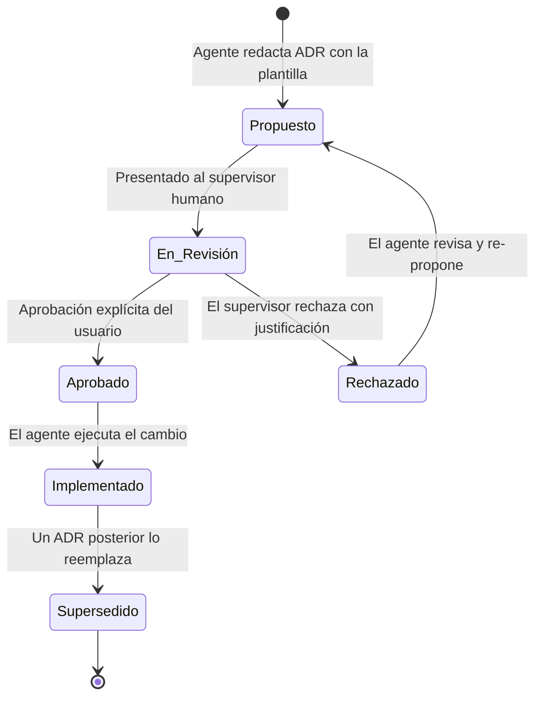

# 19 - LINEAMIENTOS DEL SISTEMA ADR (ARCHITECTURAL DECISION RECORDS)

Este documento define las reglas, los procedimientos y el ciclo de vida completo para la creación, aprobación, archivo y sustitución de Registros de Decisión Arquitectónica (ADR) en el proyecto **Tony Burgers**.

---

## 1. Ley de Decisiones Arquitectónicas (Obligatorio)

### LAW_021 - ARCHITECTURAL DECISIONS REQUIRE ADR
Any significant architectural decision must be documented using an ADR.
Examples:
* Folder structure changes
* Framework changes
* Routing strategy changes
* State management changes
* Build system changes

---

## 2. ¿Qué es un ADR?

Un **Architectural Decision Record (ADR)** es un documento de texto corto que captura una decisión de diseño o arquitectónica importante, incluyendo su contexto, la solución adoptada, las alternativas consideradas y sus consecuencias a largo plazo.

Los ADRs responden una pregunta crítica: **¿Por qué el código está estructurado de esta manera?**

Sirven como memoria inmutable del "por qué", para que ningún agente futuro revierta o contradiga una decisión ya analizada sin saber que existía.

---

## 3. ¿Cuándo se Requiere un ADR?

Un ADR es **obligatorio** antes de proceder con cualquiera de las siguientes acciones:

| Situación | Ejemplo |
| :--- | :--- |
| Cambio en la estructura de carpetas | Crear `src/components/shared/` nuevo |
| Cambio de framework o librería principal | Migrar React Router a TanStack Router |
| Cambio en la estrategia de enrutamiento | Pasar de enrutamiento por hash a pathname |
| Cambio en la gestión del estado global | Sustituir React Context por Zustand |
| Cambio en el sistema de build | Migrar de Vite a Turbopack |
| Cambio en la política de estilos | Sustituir Tailwind por CSS Modules |
| Cambio en la política de autenticación | Añadir JWT / sesiones de servidor |
| Instalación de nueva dependencia de producción | Añadir `framer-motion` para animaciones |

Un ADR **no es necesario** para:
*   Añadir un componente de UI nuevo que siga los patrones existentes.
*   Corregir un bug en un archivo existente sin cambiar contratos de datos.
*   Actualizar una variable CSS o una clase de Tailwind.
*   Cambiar el texto de una etiqueta o traducción.

---

## 4. Ciclo de Vida de un ADR

### Estados de un ADR:
*   **`Propuesto`:** El agente ha redactado el ADR usando la plantilla de [ADR_TEMPLATE.md](./ADR_TEMPLATE.md) y lo ha presentado para revisión.
*   **`En Revisión`:** El supervisor humano está evaluando el ADR.
*   **`Aprobado`:** El supervisor ha dado aprobación explícita. El agente puede proceder.
*   **`Rechazado`:** El supervisor ha rechazado la propuesta. El rechazo debe documentarse con su motivo en el mismo ADR. El agente debe revisar y re-proponer.
*   **`Implementado`:** El cambio fue ejecutado y validado satisfactoriamente.
*   **`Supersedido`:** Una decisión posterior ha reemplazado a esta. El ADR antiguo **no se elimina**; se actualiza su estado a `Supersedido` y se referencia al ADR que lo reemplaza.

---

## 5. Proceso de Aprobación

1.  El agente **redacta** el ADR usando la plantilla y lo guarda en `project-docs/adr/ADR_NNN_titulo-corto.md`.
2.  El agente **presenta** el ADR al usuario humano para su revisión.
3.  El usuario **evalúa** el ADR, pudiendo solicitar aclaraciones o cambios.
4.  Una vez aprobado, el usuario da el **visto bueno explícito** y el agente actualiza el estado a `Aprobado`.
5.  El agente **implementa** el cambio y actualiza el estado a `Implementado`.
6.  El agente **registra** la decisión en [DECISION_LOG.md](../03-memory/DECISION_LOG.md).

---

## 6. Cómo Archivar y Superseder un ADR

Cuando una decisión previamente tomada es reemplazada por una nueva:
1.  Se **crea un nuevo ADR** para la decisión que la reemplaza, referenciando el número del ADR original.
2.  Se **actualiza el ADR original** cambiando su estado a `Supersedido por ADR-XXX`.
3.  El ADR original **nunca se elimina** (cumplimiento de **LAW_018** — Project Memory Protection).
4.  Ambos ADRs se registran en [DECISION_LOG.md](../03-memory/DECISION_LOG.md).

---

## 7. Nomenclatura y Ubicación

*   **Directorio:** `project-docs/adr/`
*   **Formato de nombre:** `ADR_NNN_titulo-en-kebab-case.md`
*   **Ejemplos de nombres válidos:**
    *   `ADR_001_feature-driven-architecture.md`
    *   `ADR_002_local-storage-persistence.md`
    *   `ADR_004_migration-to-tanstack-router.md`
