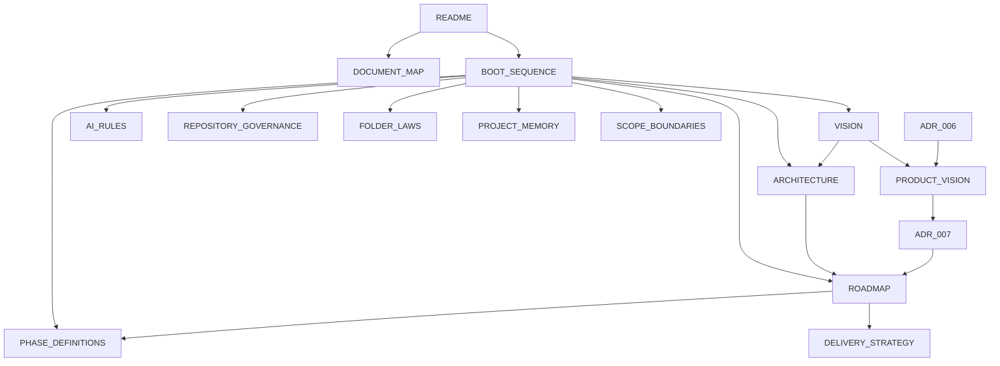

# DOCUMENT MAP — Governance Document Index

Este documento es el índice maestro de todos los documentos de gobernanza del proyecto **Tony Burgers**. Todo documento debe estar registrado aquí para ser descubrible.

**Ley Aplicable:** LAW_032 — CENTRALIZED DISCOVERY

---

## 00-governance — Leyes, Reglas y Políticas

| Documento | Propósito | Dependencias |
| :--- | :--- | :--- |
| AI_RULES.md | Reglas estrictas para agentes de IA | VISION, ARCHITECTURE, REPOSITORY_GOVERNANCE |
| REPOSITORY_GOVERNANCE.md | Constitución del repositorio con todas las leyes | — |
| LAW-067_CANONICAL_RUNTIME_LANGUAGE.md | Canonical Runtime Language — protocolo universal de comunicación entre motores cognitivos | RUNTIME_ARCHITECTURE, ENGINE_IMPLEMENTATION_STANDARD, CanonicalEvent.ts |
| LAW-068_ARCHITECTURE_DISCOVERY.md | Architecture Discovery Before Code Exploration — fase de descubrimiento obligatoria antes de implementación | EXECUTION_PROTOCOL, ENGINE_IMPLEMENTATION_STANDARD |
| FOLDER_LAWS.md | Leyes de integridad estructural de carpetas | ARCHITECTURE |
| DEPENDENCY_POLICY.md | Control de dependencias npm | REPOSITORY_GOVERNANCE |
| FOUNDATION_FREEZE_POLICY.md | Foundation v1.0 LOCKED, amendment process, seasons | REPOSITORY_GOVERNANCE, Constitution, Product Principles |
| ESCALATION_PROTOCOL.md | Protocolo de escalado de incertidumbre | REPOSITORY_GOVERNANCE, ADR_GUIDELINES |

---

## 00-vision — Restaurant OS Vision Documents

| Documento | Propósito | Dependencias |
| :--- | :--- | :--- |
| THE_CONSTITUTION_OF_RESTAURANT_OS.md | Supreme constitution (35 Articles) | — |
| PRODUCT_PRINCIPLES.md | 25 Product Principles + Review Framework | Constitution |
| RESTAURANT_OS_DESIGN_LANGUAGE.md | Restaurant OS Design Language | Product Principles |
| RESTAURANT_OS_VISUAL_SYSTEM.md | Visual System | Design Language, Product Principles |
| RESTAURANT_OS_MATERIAL_SYSTEM.md | Material System | Design Language, Visual System |
| AMBIENT_MOTION_SYSTEM.md | Ambient Motion System | Design Language, Visual System |
| RESTAURANT_OS_EXPERIENCE_HIERARCHY_SYSTEM.md | Universal grammar of attention | Constitution, Product Principles, Design Language |
| RESTAURANT_OS_COGNITIVE_BEHAVIORAL_SYSTEM.md | Cognitive & Behavioral Operating System | Constitution, Product Principles, Design Language |
| RESTAURANT_OS_SIGNATURE_EXPERIENCE.md | Emotional identity and signature moments of Restaurant OS | Constitution, Product Principles, Design Language, Cognitive Behavioral System |
| BUSINESS_INTELLIGENCE_FABRIC.md | How Restaurant OS learns from businesses — Sources of Truth, trust, learning, Business Pulse, truth resolution | Constitution, Product Principles, Business Knowledge Graph, Business Operating Model |
| RESTAURANT_HEALTH.md | Product vision for Restaurant Health | — |

---

## 01-foundation — Visión, Arquitectura y Roadmap

| Documento | Propósito | Dependencias |
| :--- | :--- | :--- |
| VISION.md | Visión estratégica del producto | — |
| ARCHITECTURE.md | Arquitectura del proyecto y flujo de datos | VISION |
| ROADMAP.md | Progresión oficial del proyecto por fases | ARCHITECTURE |
| PHASE_DEFINITIONS.md | Definiciones detalladas de cada fase | ROADMAP |
| DELIVERY_STRATEGY.md | Estrategia de entrega incremental | ROADMAP, PHASE_DEFINITIONS |
| RESTAURANT_OS_CAPABILITY_MAP.md | Permanent capability structure of Restaurant OS — 11 capabilities, maturity model, dependency network | Constitution, Product Principles, Business Knowledge Graph, Business Intelligence Fabric, Cognitive Behavioral System |
| RESTAURANT_OS_BUSINESS_ONTOLOGY.md | Permanent conceptual language of Restaurant OS — 31 core concepts with definitions, boundaries, relationships, lifecycle, naming rules, and anti-patterns | Constitution, Product Principles, Business Intelligence Fabric, Capability Map, Blueprint-001, Business Knowledge Graph, Cognitive Behavioral System |

---

## 02-blueprints — Blueprints Conceptuales Permanentes

| Documento | Propósito | Dependencias |
| :--- | :--- | :--- |
| BLUEPRINT_001_INTELLIGENCE_LOOP.md | The permanent seven-stage reasoning cycle of Restaurant OS — Observe, Understand, Remember, Explain, Recommend, Learn, Improve. Defines how every capability executes intelligence. | Constitution, Product Principles, Business Intelligence Fabric, Capability Map, Cognitive Behavioral System |

---

## 02-development — Estándares, Flujos y Calidad

| Documento | Propósito | Dependencias |
| :--- | :--- | :--- |
| CODING_STANDARDS.md | Estándares de código TypeScript y React | ARCHITECTURE |
| NAMING_CONVENTIONS.md | Convenciones de nomenclatura | ARCHITECTURE |
| TASK_WORKFLOW.md | Flujo de trabajo para resolución de tareas | REPOSITORY_GOVERNANCE |
| DEVELOPMENT_CHECKLIST.md | Checklist pre-entrega | DEFINITION_OF_DONE |
| DEFINITION_OF_DONE.md | Criterios de terminado de tareas | — |

---

## 03-memory — Memoria y Trazabilidad

| Documento | Propósito | Dependencias |
| :--- | :--- | :--- |
| PROJECT_MEMORY.md | Memoria persistente del proyecto | DECISION_LOG |
| DECISION_LOG.md | Registro de decisiones arquitectónicas (ADRs) | — |

---

## 04-boundaries — Límites y Propiedad

| Documento | Propósito | Dependencias |
| :--- | :--- | :--- |
| SCOPE_BOUNDARIES.md | Límites de alcance y fronteras del proyecto | TASK_WORKFLOW |
| FILE_OWNERSHIP.md | Propiedad de archivos y dominios | ARCHITECTURE |

---

## 05-reporting — Plantillas

| Documento | Propósito | Dependencias |
| :--- | :--- | :--- |
| CHANGE_REPORT_TEMPLATE.md | Plantilla de reporte de cambios | — |

---

## 06-adr — Architectural Decision Records

| Documento | Propósito | Dependencias |
| :--- | :--- | :--- |
| ADR_GUIDELINES.md | Lineamientos del sistema ADR | REPOSITORY_GOVERNANCE |
| ADR_TEMPLATE.md | Plantilla para nuevos ADRs | ADR_GUIDELINES |
| records/ | Directorio de archivos ADR individuales | ADR_GUIDELINES |
| records/ADR_005_phase-5-landing-assembly.md | Phase 5 landing assembly activation | ROADMAP, PHASE_DEFINITIONS |
| records/ADR_006_knowledge-first-chatbots.md | Knowledge First Chatbots architecture | ADR_GUIDELINES |
| records/ADR_007_product_direction.md | Product vision lockdown (8-phase) | VISION, ROADMAP, PRODUCT_VISION |
| records/ADR_008_product-boundary-separation.md | Restaurant Experience / Restaurant OS boundary separation | ARCHITECTURE, PROJECT_MEMORY, FILE_OWNERSHIP |

---

## 03-research — Investigación y Descubrimiento

| Documento | Propósito | Dependencias |
| :--- | :--- | :--- |
| owners/RESEARCH_001_OWNER_DECISION_MODEL.md | Modelo de decisión del dueño de restaurante | Constitution, Product Principles |
| team/RESEARCH_002_WORK_MODEL_AND_TEAM_INTELLIGENCE.md | Modelo de trabajo e inteligencia de equipo | Constitution, Product Principles, RESEARCH_001 |

---

## 09-discovery — Owner Discovery

| Documento | Propósito | Dependencias |
| :--- | :--- | :--- |
| OWNER_DISCOVERY_GUIDE.md | Guía para la primera sesión de descubrimiento con el dueño del negocio | PRODUCT_VISION |
| DEMO_READINESS_AUDIT.md | Auditoría de preparación para presentación al dueño (TASK-011) | — |
| DATA_REQUIREMENTS.md | Cuestionario estructurado para recolección de datos del negocio (TASK-020) | OWNER_DISCOVERY_GUIDE |

---

## 08-product — Product Vision

| Documento | Propósito | Dependencias |
| :--- | :--- | :--- |
| PRODUCT_VISION.md | Visión de producto a largo plazo (8 fases: Website → SaaS) | VISION, ROADMAP, ADR-007 |

---

## 07-audits — Auditorías

| Documento | Propósito | Dependencias |
| :--- | :--- | :--- |
| GOVERNANCE_AUDITS.md | Auditoría del sistema de gobernanza | Todos los documentos |
| ROADMAP_AUDITS.md | Auditoría de integración del roadmap | ROADMAP, PHASE_DEFINITIONS, DELIVERY_STRATEGY |

---

## 10-reference — Reference Business & Demo Data

| Documento | Propósito | Dependencias |
| :--- | :--- | :--- |
| BUSINESS_BIBLE.md | Canonical reference business for Via Trattoria — complete identity, menu, staff, suppliers, customers, financial history, operations, timeline, relationships, and hidden truths. Single source of truth for all demo data. | Constitution, Product Vision, Demo Design (TASK-001) |

---

## 11-protocol — Execution Protocols

| Documento | Propósito | Dependencias |
| :--- | :--- | :--- |
| EXECUTION_PROTOCOL.md | Canonical execution protocol — 14-step workflow, persona, boot sequence, Product Reasoning Layer, all laws (1–43), report format (LAW 30), communication style. Supersedes AGENTS.md (execution sections), TASK_WORKFLOW.md, CHANGE_REPORT_TEMPLATE.md. | Constitution, Product Principles, Architecture |

---

## 12-domain — Domain Model

| Document | Purpose | Dependencies |
| :--- | :--- | :--- |
| DOMAIN_MODEL.md | Canonical Domain Model — Parts 1, 9, 11, 12, 13, 14, 15: Domain Philosophy, Domain Services, Business Invariants, Dependency Graph, Extension Points, Implementation Independence Review, Consistency Review | Constitution, Product Principles, Business Intelligence Fabric, Business Knowledge Graph, Cognitive Behavioral System, Restaurant Health, Design Language, Business Bible |
| UBIQUITOUS_LANGUAGE.md | Part 2 — Official vocabulary of every domain concept with definitions, owners, and forbidden synonyms | Same as DOMAIN_MODEL.md |
| DOMAIN_MAP.md | Part 3 — Bounded context map with purpose, responsibilities, entities, events, and dependency graph | UBIQUITOUS_LANGUAGE.md |
| AGGREGATES.md | Parts 4, 5 — Every aggregate root and entity with properties, invariants, lifecycle, and owned entities | UBIQUITOUS_LANGUAGE.md, VALUE_OBJECTS.md |
| VALUE_OBJECTS.md | Parts 6, 7 — All immutable value objects and canonical enumerations with validation rules | UBIQUITOUS_LANGUAGE.md |
| DOMAIN_EVENTS.md | Part 8 — Complete domain event catalog by context with trigger, producer, consumers, and payload | UBIQUITOUS_LANGUAGE.md, AGGREGATES.md |
| RELATIONSHIP_MAP.md | Part 10 — Canonical entity relationship diagrams and cross-context relationship table | UBIQUITOUS_LANGUAGE.md, AGGREGATES.md |

---

## 13-cognition — Cognitive Architecture

| Document | Purpose | Dependencies |
| :--- | :--- | :--- |
| COGNITIVE_ARCHITECTURE.md | Permanent cognitive architecture of Restaurant OS — 13 parts: Cognitive Philosophy, Cognitive Loop (11 stages), Cognitive Layers (8), Cognitive States (11), Attention Model, Memory Architecture (9 systems), Reasoning Architecture (8 strategies), Decision Architecture, Learning Architecture, Communication Architecture, Cognitive Invariants (52), Failure Modes (12), Future Evolution (12 extensions). The constitutional document of cognition. | Constitution, Product Principles, Cognitive Behavioral System, Business Intelligence Fabric, Business Ontology, Blueprint 001, Domain Model, Execution Protocol |

---

## 14-observation — Observation System

| Document | Purpose | Dependencies |
| :--- | :--- | :--- |
| OBSERVATION_SYSTEM.md | Canonical Observation System — 9 parts: Philosophy of Observation (10 distinctions), Lifecycle (8 stages), Anatomy (19 fields), Classification (18 categories), Quality (7 dimensions), Relationships (11 connections), Invariants (60), Failure Modes (10), Future Evolution (9 extensions). The constitutional specification of the smallest cognitive unit. | Constitution, Product Principles, Business Ontology, Domain Model, Cognitive Architecture, Blueprint 001, Ubiquitous Language |

---

## 15-pattern — Pattern System

| Document | Purpose | Dependencies |
| :--- | :--- | :--- |
| PATTERN_SYSTEM.md | Canonical Pattern System — 9 parts: Philosophy of Pattern (11 distinctions), Lifecycle (9 stages), Anatomy (22 fields), Classification (20 categories), Quality (10 dimensions), Relationships (10 connections), Invariants (68), Failure Modes (10), Future Evolution (9 extensions). The constitutional specification of Pattern as the bridge between Observation and Knowledge. | Constitution, Product Principles, Business Ontology, Domain Model, Cognitive Architecture, Observation System, Blueprint 001, Ubiquitous Language |

---

## 16-evidence — Evidence System

| Document | Purpose | Dependencies |
| :--- | :--- | :--- |
| EVIDENCE_SYSTEM.md | Canonical Evidence System — 9 parts: Philosophy of Evidence (12 distinctions), Lifecycle (9 stages), Anatomy (27 fields), Classification (19 categories), Quality (10 dimensions), Relationships (10 connections), Invariants (70), Failure Modes (10), Future Evolution (9 extensions). The constitutional specification of Evidence as the justification layer of Restaurant OS. | Constitution, Product Principles, Business Ontology, Domain Model, Cognitive Architecture, Observation System, Pattern System, Blueprint 001, Ubiquitous Language |

---

## 17-memory-system — Memory System

| Document | Purpose | Dependencies |
| :--- | :--- | :--- |
| MEMORY_SYSTEM.md | Canonical Memory System — 9 parts: Philosophy of Memory (12 distinctions), Lifecycle (9 stages), Anatomy (25 fields), Classification (16 categories), Quality (10 dimensions), Relationships (10 connections), Invariants (85), Failure Modes (10), Future Evolution (10 extensions). The constitutional specification of Memory as the persistent cognitive structure of Restaurant OS. | Constitution, Product Principles, Business Ontology, Domain Model, Cognitive Architecture, Observation System, Pattern System, Evidence System, Blueprint 001, Ubiquitous Language |

---

## 18-knowledge-system — Knowledge System

| Document | Purpose | Dependencies |
| :--- | :--- | :--- |
| KNOWLEDGE_SYSTEM.md | Canonical Knowledge System — 9 parts: Philosophy of Knowledge (15 distinctions), Lifecycle (10 stages), Anatomy (22 fields), Classification (17 categories), Quality (12 dimensions), Relationships (16 connections), Invariants (110), Failure Modes (10), Future Evolution (10 extensions). The constitutional specification of Knowledge as the bridge between Memory and Reasoning in Restaurant OS. | Constitution, Product Principles, Business Ontology, Domain Model, Cognitive Architecture, Observation System, Pattern System, Evidence System, Memory System, Blueprint 001, Ubiquitous Language |

---

## 19-attention-system — Attention System

| Document | Purpose | Dependencies |
| :--- | :--- | :--- |
| ATTENTION_SYSTEM.md | Canonical Attention System — 13 parts: Philosophy of Attention (14 distinctions), Lifecycle (11 stages), Anatomy (25 fields), Classification (16 categories), Quality (12 dimensions), Relationships (12 connections), Allocation Model, Policies (9 categories), Invariants (120), Failure Modes (10), Recovery Mechanisms (10), Business Examples (6), Constitutional Principles. The constitutional specification of Attention as the scarcest cognitive resource in Restaurant OS. | Constitution, Product Principles, Business Ontology, Domain Model, Cognitive Architecture, Observation System, Pattern System, Evidence System, Memory System, Knowledge System, Experience Hierarchy System, Blueprint 001, Ubiquitous Language |

---

## 20-reasoning-engine — Reasoning Engine

| Document | Purpose | Dependencies |
| :--- | :--- | :--- |
| REASONING_ENGINE.md | Canonical Reasoning Engine — 13 parts + 8 appendices: Philosophy of Reasoning (18 distinctions), Lifecycle (12 stages), Anatomy (25 fields), Reasoning Types (14 types), Quality (14 dimensions), Relationships (16 connections), Pipeline (14 stages), Policies (10 categories), Invariants (210 across 25 categories), Failure Modes (25 across 10 categories), Recovery Framework (5 strategies with lifecycle/triggers/escalation/rollback/retry/human intervention/learning), Business Examples (13 scenarios including Predictive, Composite, and Emergency), Constitutional Principles (28 principles). Appendices: Glossary, Cognitive Terminology, Reasoning Object Schema, State Machine (with transition rules), Sequence Diagrams (standard/recovery/composite), Relationship Diagrams, Quality Checklist, Audit Checklist. The constitutional specification of Reasoning as the bridge between Attention and Decision in Restaurant OS. The first Cognitive Engine. | Constitution, Product Principles, Business Ontology, Domain Model, Cognitive Architecture, Observation System, Pattern System, Evidence System, Memory System, Knowledge System, Attention System, Experience Hierarchy System, Blueprint 001, Ubiquitous Language |

---

## 21-human-experience-constitution — Human Experience Constitution

| Document | Purpose | Dependencies |
| :--- | :--- | :--- |
| HUMAN_EXPERIENCE_CONSTITUTION.md | Canonical Human Experience Constitution — 17 parts + 4 appendices: Philosophy of Human Experience (13 foundational principles), Restaurant Glass Philosophy (10 conceptual principles), Invisible Intelligence Principle (5 levels, 5 principles), Calm Technology Philosophy (5 principles, center/periphery model), Silence and Communication (6 principles, 5 silence types), Emotional Principles (12 principles, 10 anti-patterns), Behavioral Principles (12 sections), Trust Principles (build/loss/recovery/authority), Employee Growth Philosophy (10 principles, coach vs surveillance), Owner Philosophy (6 principles, anti-patterns), Customer Philosophy (4 principles, anti-patterns), Role-Specific Philosophies (12 roles with feel/never-feel pairs), Constitutional Principles (50 principles across 9 domains), Invariants (285 across 25 categories), Failure Modes (25 modes), Recovery Mechanisms (8 mechanisms, role-based recovery, 8 principles), Business Examples (24 examples across 12 roles). Appendices: Glossary (40+ terms), Emotional State Machine (10 states, 17 transitions), Communication Language Patterns (50+ patterns across 9 categories), Consistency Verification (20 source documents, 16 tech-agnostic checks). The constitutional emotional specification that governs every human interaction in Restaurant OS. | Constitution, Product Principles, Cognitive Architecture, Attention System, Reasoning Engine, Business Ontology, Domain Model, Blueprint 001 |

---

## 22-cognitive-engine-contract — Cognitive Engine Contract

| Document | Purpose | Dependencies |
| :--- | :--- | :--- |
| COGNITIVE_ENGINE_CONTRACT.md | Canonical Cognitive Engine Contract — 28 parts + 2 appendices: Philosophy of Cognitive Engines (7 sections), Engine Definition (System vs Engine vs Capability vs Module), Engine Philosophy (12 domains: purpose, responsibilities, authority, limitations, dependencies, outputs, consumers, lifecycle, quality, failure, recovery, evolution), Engine Contracts (8 sections: accept, reject, produce, never produce, modify, cannot modify, assume, never assume), Cognitive Ownership (18 functions mapped with boundaries and 5 rules), Canonical Cognitive Pipeline (13 stages, why order exists, why stages cannot be skipped, exception rules, 8 branching paths, 4 feedback loops), Allowed Communication (40 relationships, 6 patterns, 4 rules), Forbidden Communication (15 forbidden patterns, 7 principles), Engine Independence (replaceability, coherence, exposing cognition vs implementation, autonomy), Engine Quality (15 dimensions), Human Alignment (8 alignment requirements), Cross-Engine Rules (collaboration, negotiation, escalation, conflict resolution, uncertainty sharing, confidence propagation), Engine Evolution (version, compatibility, constitutional evolution, 7 principles), Failure Propagation (how cognition continues, uncertainty propagation, confidence change, recovery initiation), Recovery Philosophy (graceful degradation, partial cognition, safe cognition, human takeover, owner override), Examples (5 foundational pipeline examples), Canonical Relationships (40 relationships across 10 categories), Policies (18 categories), Quality Dimensions Detailed (15 dimensions with measurement, threshold, degradation), Failure Modes (29 modes with detection and classification), Recovery Mechanisms (15 mechanisms with process and 8 principles), Constitutional Principles (55 across 12 categories), Invariants (380 across 25 categories), Engine Contract Specifications (18 engine contracts: Observation, Pattern, Evidence, Memory, Knowledge, Attention, Reasoning, Decision, Planning, Execution, Learning, Prediction, Recommendation, Conversation, Reflection, Business Pulse, Coordination, Human Experience), Advanced Restaurant Examples (6 scenarios: owner decision support, inventory crisis, menu introduction, employee performance, emergency ordering failure, cross-engine conflict resolution), Pipeline Expansion (8 branching paths, synchronization, 4 feedback loops, exception rules), Engine Test and Verification (pre/operational/post, 10 verification categories, 9 frequencies, Human-Verifiable Contract, 7 principles), Engine Retirement (criteria, process, rules). The constitutional contract between ALL cognitive engines in Restaurant OS. Every future engine must derive from this document. No engine may violate it. | Constitution, Human Experience Constitution, Business Ontology, Domain Model, Cognitive Architecture, Observation System, Pattern System, Evidence System, Memory System, Knowledge System, Attention System, Reasoning Engine, Blueprint 001 |

---

## 22-cognitive-atlas — Cognitive Atlas

| Document | Purpose | Dependencies |
| :--- | :--- | :--- |
| COGNITIVE_ATLAS.md | Master Navigation Layer — 30 parts + 1 appendix, 4,000+ lines. Part 1: Purpose of the Atlas (why navigation is required, 5 critical distinctions, 8 atlas principles, 12 use-case navigation guide). Part 2: Global Restaurant OS Map (9-layer hierarchy from Constitution to Protocol, map of maps table, complete engine registry with all 18 engines, engine status summary). Part 3: Constitution Dependency Graph (8 relationship types, complete dependency graph for 22+ documents, governance hierarchy, document categories by role). Part 4: Engine Dependency Graph (6 dependency types, full 18-engine dependency table, dependency depth, 6 critical paths, 10 dependency constraints, quality requirements). Part 5: Business Knowledge Graph (25 core business concepts with cognitive owners, 30 extended concepts, concept-to-engine x-reference for 13 engines, business event-to-engine matrix). Part 6: Concept Graph (25 master concepts, concept density by document cluster, 17 concept clusters, virtuous/vicious cycles with 5 virtuous and 3 vicious cycles, cycle break interventions, 30 extended concept definitions). Part 7: Engine Communication Graph (complete 18×18 communication matrix, 6 communication patterns with examples, 10 communication constraints, 15 forbidden communications, 9 escalation routes, confidence propagation, failure propagation). Part 8: Information Flow Atlas (13-stage complete lifecycle with stage details, 13-stage summary table, 21 flow constraints, 11 information quality gates, 10 flow rules). Part 9: Business Event Atlas (15 detailed business events with full flow maps: Order Arrives, Inventory Low, Employee Absent, Customer Complaint, Revenue Drop, Equipment Failure, Supplier Delay, Holiday, New Menu Launch, Customer Arrives, Payment Processed, Reservation Made, Health Inspection, End of Day, Staff Performance Review). Part 10: Restaurant Glass Atlas (5 principles by domain, 15 system aspect applications, 8 anti-patterns). Part 11: Human Experience Atlas (12-role interaction map, role-based emotional states). Part 12: Cognitive Pipeline Atlas (12 pipeline stages, 8 branches, 4 feedback loops, 6 recovery paths). Part 13: Semantic Navigation (10 dimensions: 48 concept entries, 16 business areas, 18 engines with full contracts, 5 constitution documents, 20 risk areas, 28 problem entries, 15 lifecycle stages, 12 role guides). Part 14: Cross References (22-document cross-reference table, 21 document-to-concept mappings, 18 engine-to-concept mappings, governance cross-reference, 15 concept-to-document entries). Part 15: Future Expansion Map (10 reserved engines, 5 business modules, 5 experience systems, 4 constitutional documents). Part 16: Document Topology (7-layer spatial arrangement, 20 document distance pairs, 7 document clusters). Part 17: Philosophy Topology (7 philosophical systems, 18-engine philosophy application, 9 cross-references, philosophy hierarchy with tertiary). Part 18: Cognitive Layer Map (9 layers with functions/examples/governance/quality, layer interaction rules, 10 layer communication constraints, layer failure isolation). Part 19: Quality Dimension Map (13 engine quality dimensions, 18 cross-engine quality dependencies, 3 quality degradation paths, 10 recovery mechanisms). Part 20: Failure Mode Atlas (10 engines × 10-25 modes, 20 expanded failure mode details, 7 failure propagation paths, 12 detection mechanisms). Part 21: Recovery Path Atlas (7 recovery strategies, 5 escalation levels, 4 severity thresholds, 10 detailed recovery procedures, 6 verification steps). Part 22: Invariant Map (10 documents × ~1,440 invariants, 25 categories with counts, invariant density hierarchy). Part 23: Principle Map (4 constitutional documents × 16 categories, 13-engine principle coverage, 8 principle conflict resolutions). Part 24: Role-Based Navigation (9 roles: Owner 12 needs, Manager 11, Employee 9, Kitchen Helper 5, Delivery Coordinator 5, New Employee 6, Experienced Employee 5, Multi-Location Owner 6, Customer 5). Part 25: Scenario-Based Navigation (9 scenarios: Morning Opening, Lunch Rush, End of Day, Emergency, Inventory Crisis, Customer Complaint Resolution, New Menu Launch, End of Shift Review, Weekly Business Review). Part 26: Learning Path Atlas (6 learning types, learning lifecycle, learning intensity by event, 8 learning sources). Part 27: Evolution Map (7 evolution events, 11 evolution triggers, 7 verification checks). Part 28: Semantic Coordinates (6-coordinate system, 28 concept coordinates, 10 coordinate search examples). Part 29: Navigation Matrices (7 matrices: document-to-engine 22×18, all-engines 22×18, concept-to-engine 16×14, concept-to-business-area 13×6, business-area-to-document 6×7, pipeline-stage-to-engine 12×4, quality-dimension-to-engine 10×12). Part 30: Constitution of the Atlas (25 Atlas Laws, 5 Atlas Obligations, 5 Governance Principles). Appendix A: Consistency Verification (28 audit checks all PASS, detailed verification notes with methodology, 22 source documents verified with detailed tables, 18 technology-agnostic checks with detailed findings, comprehensive final metrics). Technology-agnostic. All checks pass. | ALL documents (navigation), Engine Contract, Human Experience Constitution, Constitution, Cognitive Architecture |

---

## 23-runtime-architecture — Runtime Architecture

| Document | Purpose | Dependencies |
| :--- | :--- | :--- |
| RUNTIME_ARCHITECTURE.md | Executable Runtime Architecture — 34 parts + appendix: Runtime Philosophy (8 principles, Runtime vs Engine), Runtime Responsibilities (10 responsibilities), Engine Lifecycle (9 stages with triggers/steps/validation/failure conditions), Runtime State Machine (11 states with transition rules), Runtime Scheduler (7 scheduling policies, scheduling cycles), Event Bus (5 event types, event structure, 5 guarantees, 5 policies), Context Bus (6 context types, operations, 5 policies), Memory Manager (5 memory types, allocation, 6 policies), Confidence Propagation (4 invariant enforcement, propagation mechanism, degradation), Audit Pipeline (scope, record structure, 6 policies), Error Pipeline (4 classification dimensions, error flow, severity response), Recovery Pipeline (5 stages, 6 strategies, 5 policies), Engine Discovery (3 sources, discovery process, 5 policies), Engine Registration (process, rejection conditions), Engine Metadata (16 fields), Engine Manifest (complete YAML structure, validation criteria), Engine Contracts (storage, enforcement, violation response), Engine Dependency Resolution (5 dependency types, resolution process, 5 policies), Engine Communication (5 channels, 5 patterns, 5 policies), Pipeline Orchestration (4 stages mapped to engines, 5 rules, orchestration process), Parallel Execution (5 rules, execution model), Sequential Execution (4 rules), Priority Resolution (5 priority levels, resolution process), Conflict Resolution (5 conflict types, resolution process, 4 policies), Runtime Policies (5 categories: Resource, Load Shedding, Governance, Safety, Evolution), Runtime Invariants (9 categories, 40+ invariants), Runtime Failure Modes (10 modes with detection and recovery), Runtime Recovery (7 mechanisms, 5 principles), Runtime Governance (6 responsibilities, 8 mechanisms, escalation), Runtime Quality Model (8 dimensions), Runtime Metrics (7 categories), Runtime Extensibility (7 extension points, 5 policies), Runtime Versioning (semantic versioning, breaking change definition, lifecycle), Runtime Evolution (6 principles, 4 triggers, 7-stage evolution process, 5 future paths), Engine Catalog Registration (18 engines mapped with runtime roles, contract preservation). Appendix A: Consistency Audit (13 checks, 10 technology-agnostic checks). Foundation quality. No TODOs. No placeholders. | Constitution, Cognitive Engine Contract, Cognitive Architecture, Human Experience Constitution, Capability Map, Business Ontology, Cognitive Atlas |

---

## 24-decision-constitution — Decision Constitution

| Document | Purpose | Dependencies |
| :--- | :--- | :--- |
| DECISION_CONSTITUTION.md | Canonical Decision Constitution — 15 parts + 6 appendices: Philosophy of Decision (11 sections), Principles (55 — DCP-001 to DCP-055), Invariants (340 — INV-DEC-001 to INV-DEC-340 across 14 categories), Lifecycle (15 stages with transition rules and failure modes), Dimensions (15 evaluation dimensions), DecisionEnvelope (22 required sections), Reversibility theory (3-tier classification), Human Impact framework (10 sub-dimensions), Ethical Decision Model (6 frameworks), Failure Modes (30 — FM-001 to FM-030 with detection/prevention/recovery), Recovery Model (9 strategies), Relationships (7 engine contracts), Quality Framework (10 dimensions), Business Examples (20 scenarios), Decision Vocabulary (22 terms). Appendices: State Machine, Envelope Schema, Audit Checklist (40 checks), Constitution Audit, Quality Checklist, Relationship Matrix (9×10 inter-engine communication). The constitutional specification of Decision as the consummation of cognition in Restaurant OS. | Constitution, Product Principles, Cognitive Architecture, Reasoning Engine, Cognitive Engine Contract, Business Ontology, Domain Model, Blueprint 001 |

---

## intelligence — Intelligence Phase (V2) Data Contracts

| Document | Purpose | Dependencies |
| :--- | :--- | :--- |
| RESTAURANT_OS_INTELLIGENCE_ROADMAP.md | V2 Intelligence Roadmap — philosophy, objectives, 5 Intelligence Sprints (IS1–IS5), scope, non-objectives, baseline commitment | V1 Architecture (AUD-MASTER-001), V2_BASELINE |
| DATA_SOURCES.md | 10 data sources classified (Orders, Inventory, Kitchen, Delivery, Customers, Sales, Weather, Suppliers, Promotions, Reviews) with origin, frequency, format, engine consumer | RESTAURANT_OS_INTELLIGENCE_ROADMAP |
| ENGINE_DATA_MATRIX.md | 10×13 matrix mapping data sources to all 13 cognitive engines with consumption indicators | DATA_SOURCES, Cognitive Engine Contract |
| V2_BASELINE.md | Official V1 baseline freeze declaration — V1 frozen as certified baseline, no architectural regression permitted | AUD-MASTER-001 |
| **CANONICAL_ORDER_EVENT_SPEC.md** | **🏆 CANONICAL — Official Canonical Order Event contract v1.0.0. Single canonical format for all orders entering Restaurant OS. 16 sections, 31 validation rules, 6 source conversions, 3 examples. All external sources must convert to this format before entering the Cognitive Pipeline.** | Observation System, Cognitive Engine Contract, Orders API |

---

## backlog — Future Opportunities

| Documento | Propósito |
| :--- | :--- |
| (empty) | Emerging features discovered during implementation. See LAW 27. |

---

## technical-debt — Technical Debt Registry

| Documento | Propósito |
| :--- | :--- |
| (empty) | Registered shortcuts and deferred fixes. See LAW 29. |

---

## Raíz de project-docs/

| Documento | Propósito | Dependencias |
| :--- | :--- | :--- |
| README.md | Hub de navegación de documentación | — |
| DOCUMENT_MAP.md | Este documento — índice maestro | — |
| BOOT_SEQUENCE.md | Secuencia de arranque obligatoria para agentes | Todos los documentos de arranque |

---

## Mapa de Referencias Cruzadas

