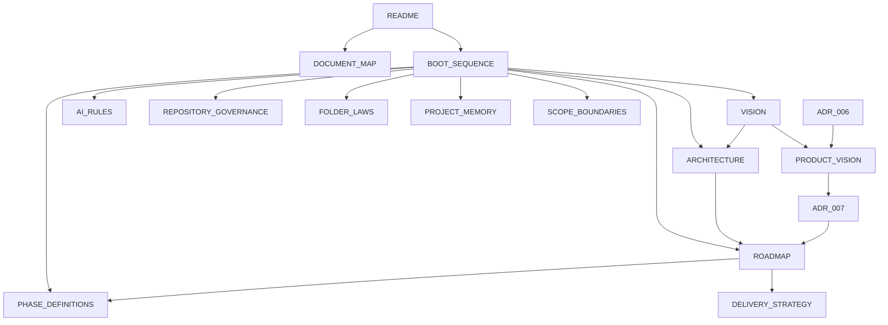

# DOCUMENT MAP — Governance Document Index

Este documento es el índice maestro de todos los documentos de gobernanza del proyecto **Tony Burgers**. Todo documento debe estar registrado aquí para ser descubrible.

**Ley Aplicable:** LAW_032 — CENTRALIZED DISCOVERY

---

## 00-governance — Leyes, Reglas y Políticas

| Documento | Propósito | Dependencias |
| :--- | :--- | :--- |
| AI_RULES.md | Reglas estrictas para agentes de IA | VISION, ARCHITECTURE, REPOSITORY_GOVERNANCE |
| REPOSITORY_GOVERNANCE.md | Constitución del repositorio con todas las leyes | — |
| FOLDER_LAWS.md | Leyes de integridad estructural de carpetas | ARCHITECTURE |
| DEPENDENCY_POLICY.md | Control de dependencias npm | REPOSITORY_GOVERNANCE |
| ESCALATION_PROTOCOL.md | Protocolo de escalado de incertidumbre | REPOSITORY_GOVERNANCE, ADR_GUIDELINES |

---

## 01-foundation — Visión, Arquitectura y Roadmap

| Documento | Propósito | Dependencias |
| :--- | :--- | :--- |
| VISION.md | Visión estratégica del producto | — |
| ARCHITECTURE.md | Arquitectura del proyecto y flujo de datos | VISION |
| ROADMAP.md | Progresión oficial del proyecto por fases | ARCHITECTURE |
| PHASE_DEFINITIONS.md | Definiciones detalladas de cada fase | ROADMAP |
| DELIVERY_STRATEGY.md | Estrategia de entrega incremental | ROADMAP, PHASE_DEFINITIONS |

---

## 02-development — Estándares, Flujos y Calidad

| Documento | Propósito | Dependencias |
| :--- | :--- | :--- |
| CODING_STANDARDS.md | Estándares de código TypeScript y React | ARCHITECTURE |
| NAMING_CONVENTIONS.md | Convenciones de nomenclatura | ARCHITECTURE |
| TASK_WORKFLOW.md | Flujo de trabajo para resolución de tareas | REPOSITORY_GOVERNANCE |
| DEVELOPMENT_CHECKLIST.md | Checklist pre-entrega | DEFINITION_OF_DONE |
| DEFINITION_OF_DONE.md | Criterios de terminado de tareas | — |

---

## 03-memory — Memoria y Trazabilidad

| Documento | Propósito | Dependencias |
| :--- | :--- | :--- |
| PROJECT_MEMORY.md | Memoria persistente del proyecto | DECISION_LOG |
| DECISION_LOG.md | Registro de decisiones arquitectónicas (ADRs) | — |

---

## 04-boundaries — Límites y Propiedad

| Documento | Propósito | Dependencias |
| :--- | :--- | :--- |
| SCOPE_BOUNDARIES.md | Límites de alcance y fronteras del proyecto | TASK_WORKFLOW |
| FILE_OWNERSHIP.md | Propiedad de archivos y dominios | ARCHITECTURE |

---

## 05-reporting — Plantillas

| Documento | Propósito | Dependencias |
| :--- | :--- | :--- |
| CHANGE_REPORT_TEMPLATE.md | Plantilla de reporte de cambios | — |

---

## 06-adr — Architectural Decision Records

| Documento | Propósito | Dependencias |
| :--- | :--- | :--- |
| ADR_GUIDELINES.md | Lineamientos del sistema ADR | REPOSITORY_GOVERNANCE |
| ADR_TEMPLATE.md | Plantilla para nuevos ADRs | ADR_GUIDELINES |
| records/ | Directorio de archivos ADR individuales | ADR_GUIDELINES |
| records/ADR_005_phase-5-landing-assembly.md | Phase 5 landing assembly activation | ROADMAP, PHASE_DEFINITIONS |
| records/ADR_006_knowledge-first-chatbots.md | Knowledge First Chatbots architecture | ADR_GUIDELINES |
| records/ADR_007_product_direction.md | Product vision lockdown (8-phase) | VISION, ROADMAP, PRODUCT_VISION |

---

## 09-discovery — Owner Discovery

| Documento | Propósito | Dependencias |
| :--- | :--- | :--- |
| OWNER_DISCOVERY_GUIDE.md | Guía para la primera sesión de descubrimiento con el dueño del negocio | PRODUCT_VISION |
| DEMO_READINESS_AUDIT.md | Auditoría de preparación para presentación al dueño (TASK-011) | — |

---

## 08-product — Product Vision

| Documento | Propósito | Dependencias |
| :--- | :--- | :--- |
| PRODUCT_VISION.md | Visión de producto a largo plazo (8 fases: Website → SaaS) | VISION, ROADMAP, ADR-007 |

---

## 07-audits — Auditorías

| Documento | Propósito | Dependencias |
| :--- | :--- | :--- |
| GOVERNANCE_AUDITS.md | Auditoría del sistema de gobernanza | Todos los documentos |
| ROADMAP_AUDITS.md | Auditoría de integración del roadmap | ROADMAP, PHASE_DEFINITIONS, DELIVERY_STRATEGY |

---

## Raíz de project-docs/

| Documento | Propósito | Dependencias |
| :--- | :--- | :--- |
| README.md | Hub de navegación de documentación | — |
| DOCUMENT_MAP.md | Este documento — índice maestro | — |
| BOOT_SEQUENCE.md | Secuencia de arranque obligatoria para agentes | Todos los documentos de arranque |

---

## Mapa de Referencias Cruzadas

